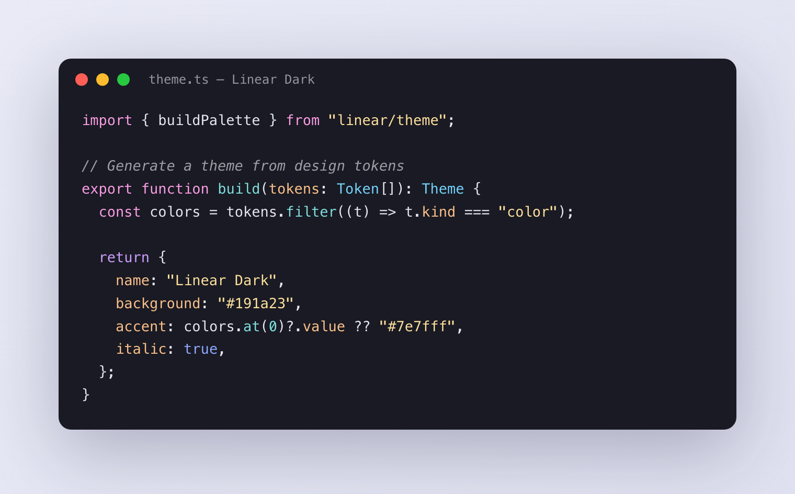
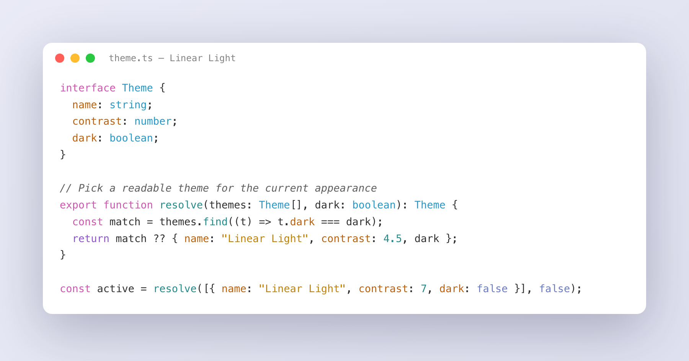

# Linear Theme

Light and dark themes for Ghostty, cmux, Zed, and Alacritty, built from Linear's own colours.

## Preview





## Install

```sh
git clone https://github.com/mblode/linear-theme.git
cd linear-theme
./install.sh
```

Sets up all four apps. For one: `./install.sh ghostty|zed|alacritty`.

## Ghostty & cmux

Both read the same files. In `~/.config/ghostty/config`:

```
theme = light:linear-light,dark:linear-dark
```

Follows system light/dark; or pin `theme = linear-dark`. Reload with `cmd-shift-,`. In cmux, leave the Appearance picker on System (it writes a `theme =` line that overrides this) and set the theme here.

## Zed

`cmd-k cmd-t`, or in `settings.json`:

```json
"theme": { "mode": "system", "light": "Linear Light", "dark": "Linear Dark" }
```

Covers UI, syntax, and the built-in terminal.

## Other terminals

`terminals/` has the same palette in each native format:

| Terminal | File | Load with |
| --- | --- | --- |
| Alacritty | `alacritty-{light,dark}.toml` | `[general] import = ["…/alacritty-dark.toml"]` |
| Kitty | `kitty-{light,dark}.conf` | `include kitty-dark.conf` |
| WezTerm | `wezterm-{light,dark}.lua` | `require` into `color_schemes` |
| iTerm2 | `iterm2-{light,dark}.itermcolors` | double-click, then Settings → Profiles → Colors |
| Warp | `warp-{light,dark}.yaml` | drop into `~/.warp/themes/` |

`./install.sh alacritty` installs the Alacritty files; the rest are copy-in.

## diffs.com & Shiki

`shiki/linear-{light,dark}.json` are [Shiki](https://shiki.style) / VS Code themes from Linear's scope map. [diffs.com](https://diffs.com) runs on Shiki, so they load there, plus VS Code, Astro, VitePress, and Monaco:

```js
import { createHighlighter } from "shiki";
import linearDark from "./shiki/linear-dark.json" with { type: "json" };

const hl = await createHighlighter({ themes: [linearDark], langs: ["ts"] });
hl.codeToHtml(code, { lang: "ts", theme: "Linear Dark" });
```

## Terminal syntax (bat & delta)

`textmate/linear-{light,dark}.tmTheme` bring Linear syntax to `bat` and `delta` (git diffs) in any terminal:

```sh
mkdir -p "$(bat --config-dir)/themes"
cp textmate/linear-*.tmTheme "$(bat --config-dir)/themes/"
bat cache --build
bat --theme="Linear Dark" file.ts
```

For `delta`, set `syntax-theme = Linear Dark` under `[delta]` in `~/.gitconfig`. Also works in Sublime Text and TextMate.

## Palette

### Linear Dark

| Name | Hex | RGB | HSL | |
| --- | --- | --- | --- | --- |
| Background | `#191a23` | `25 26 35` | `234 17% 12%` |  |
| Foreground | `#e5e6ef` | `229 230 239` | `234 24% 92%` |  |
| Comment | `#9d9ea6` | `157 158 166` | `233 5% 63%` |  |
| Keyword (pink) | `#fa9ce3` | `250 156 227` | `315 90% 80%` |  |
| Control flow (purple) | `#cc9dff` | `204 157 255` | `269 100% 81%` |  |
| String (gold) | `#ffe09e` | `255 224 158` | `41 100% 81%` |  |
| Function / number (teal) | `#7fdede` | `127 222 222` | `180 59% 68%` |  |
| Type / class (blue) | `#73d1fa` | `115 209 250` | `198 93% 72%` |  |
| Property / key (orange) | `#fac08a` | `250 192 138` | `29 92% 76%` |  |
| Constant / boolean (indigo) | `#8fa7ff` | `143 167 255` | `227 100% 78%` |  |
| Regex | `#db5926` | `219 89 38` | `17 72% 50%` |  |
| Error | `#ff5c6c` | `255 92 108` | `354 100% 68%` |  |
| Accent / cursor | `#7e7fff` | `126 127 255` | `240 100% 75%` |  |
| Selection | `#2b2d4d` | `43 45 77` | `236 28% 24%` |  |

### Linear Light

| Name | Hex | RGB | HSL | |
| --- | --- | --- | --- | --- |
| Background | `#ffffff` | `255 255 255` | `0 0% 100%` |  |
| Foreground | `#303032` | `48 48 50` | `240 2% 19%` |  |
| Comment | `#5e5e60` | `94 94 96` | `240 1% 37%` |  |
| Keyword (pink) | `#ce55b0` | `206 85 176` | `315 55% 57%` |  |
| Control flow (purple) | `#8e54cb` | `142 84 203` | `269 53% 56%` |  |
| String (gold) | `#bf830a` | `191 131 10` | `40 90% 39%` |  |
| Function / number (teal) | `#248b8b` | `36 139 139` | `180 59% 34%` |  |
| Type / class (blue) | `#2797c7` | `39 151 199` | `198 67% 47%` |  |
| Property / key (orange) | `#bb610c` | `187 97 12` | `29 88% 39%` |  |
| Constant / boolean (indigo) | `#687bc4` | `104 123 196` | `228 44% 59%` |  |
| Regex | `#d85927` | `216 89 39` | `17 69% 50%` |  |
| Error | `#ff5d6c` | `255 93 108` | `354 100% 68%` |  |
| Accent / cursor | `#6d78d5` | `109 120 213` | `234 55% 63%` |  |
| Selection | `#edeef8` | `237 238 248` | `235 44% 95%` |  |

## License

MIT
